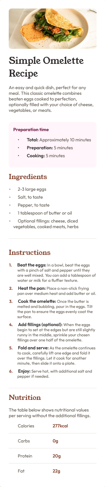

# Frontend Mentor - Recipe page


## Welcome! 👋

Thanks for checking out this front-end coding challenge.

[Frontend Mentor](https://www.frontendmentor.io) challenges help you improve your coding skills by building realistic projects.

# Frontend Mentor - Recipe page solution

This is a solution to the [Recipe page challenge on Frontend Mentor](https://www.frontendmentor.io/challenges/recipe-page-KiTsR8QQKm). Frontend Mentor challenges help you improve your coding skills by building realistic projects. 

## Table of contents

- [Overview](#overview)
  - [Screenshot](#screenshot)
  - [Links](#links)
- [My process](#my-process)
  - [Built with](#built-with)
  - [What I learned](#what-i-learned)
  - [Continued development](#continued-development)
  - [Useful resources](#useful-resources)
- [Author](#author)

## Overview

### Screenshot



### Links

- Solution URL: [My solution URL here](https://github.com/ClementServant/Recipe-page)
- Live Site URL: [My live site URL here](https://clementservant.github.io/Recipe-page/)

## My process

### Built with

- Semantic HTML5 
- CSS custom properties
- CSS Grid

### What I learned

On this project, I learned about the <hr /> tag and how to use it, which I didn't know. Which enabled me to make the separations between the different sections and in the nutrition part.

```html
<hr />
```

```css
hr {
    width: 100%;
    border: none;
    border-top: 1px solid var(--Light-Grey);
}

hr {
    grid-column: 1 / span 2;
    margin-bottom: 1rem;
    margin-top: 1rem;
}
```
### Continued development

I'm going to work more on CSS grid, which I never use. I think knowing how to use grid and flex box is important depending on the project, and knowledge of both is important. Also work on the style sheet layout (reset, declarations: root, global styles). I think my CSS could have been shorter, I've got too many repetitions (font-family, font-weight), and I need to work on that too. Finally, the README.md editorial team has been hard at work, especially in English.

### Useful resources

- [Resource used for <hr />](https://developer.mozilla.org/fr/docs/Web/HTML/Element/hr) - This helped me understand how this element works and how to use it. I discovered it on a forum by Googling "How to separate sections in HTML", someone mentioned this element, so I looked it up on mdn.
- [Resource used for CSS gri](https://developer.mozilla.org/fr/docs/Web/CSS/CSS_grid_layout) - It helped me understand the concept and use of CSS grid a little better.

## Author

- Frontend Mentor - [@ClementServant](https://www.frontendmentor.io/profile/ClementServant)
- Page Facebook - [@ClemCode Creations](https://www.facebook.com/profile.php?id=61558749970948)
- Profil LinkedIn - [@Clement Servant](www.linkedin.com/in/servantclement)


